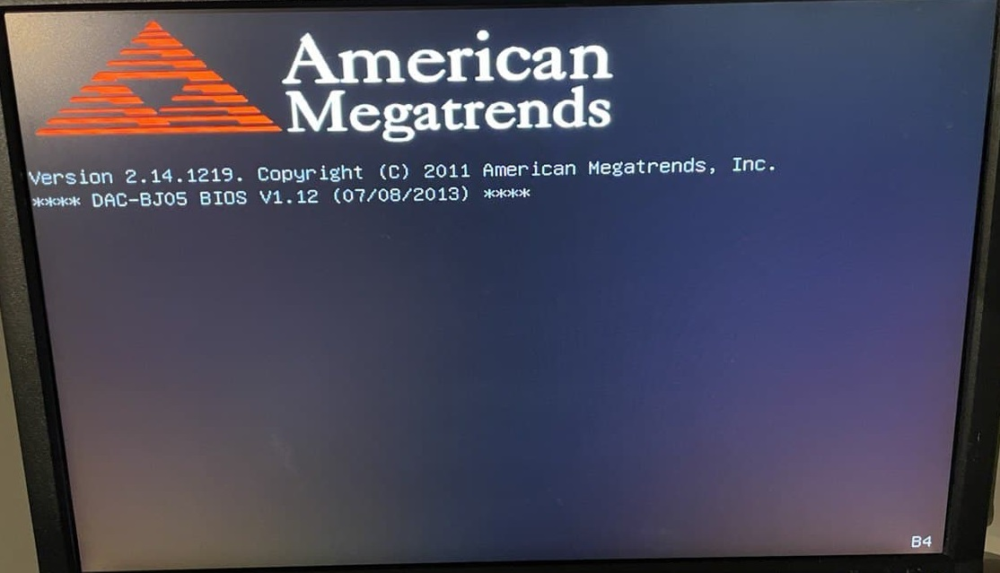
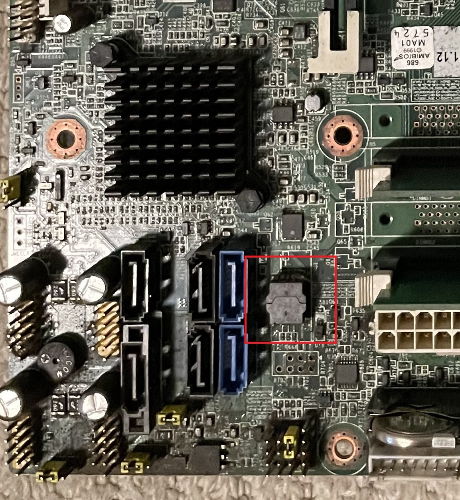
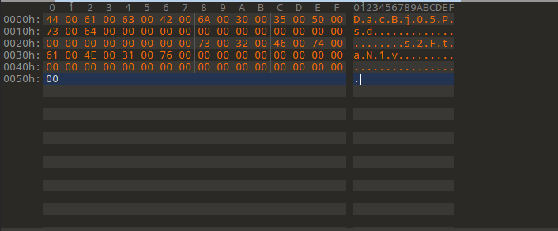

# Bios
The machine uses AMI 2.14.1219, the bios settings is also protected with user password and admin password.



## Bios password
The bios password cannot be reset using clear CMOS or by removing bios battery. Special tools needed to extract the bios chip and use software to extract the encrypted password and decrypt using the decryption key.

### Bios location


You can use EEPROM or any memory chip dumper to dump the content of this chip, and later use UEFITool to extract the hashed password from the bios.

A detailed guide can be fund [here](https://gist.github.com/en4rab/550880c099b5194fbbf3039e3c8ab6fd)

### Bios password encryption key
According to the guide linked above, the BIOS key is encrypted with XOR with the following key.

```
5B 93 B6 26 11 BA 6C 4D C7 E0 22 74 7D 07 D8 9A 33 2E 8E C1 E9 54 44 E8 9F 7B FA 0E 55 A2 B0 35 
0B C9 66 5C C1 EF 1C 83 77 16 D2 A9 2D 3D 88 D0 E3 63 3E F7 99 8A F4 1D 4F B1 AA 44 05 D8 60 6B
```

Luckily, after decryption, the password is in plain text so we can use it without mapping it with the scancode table.

