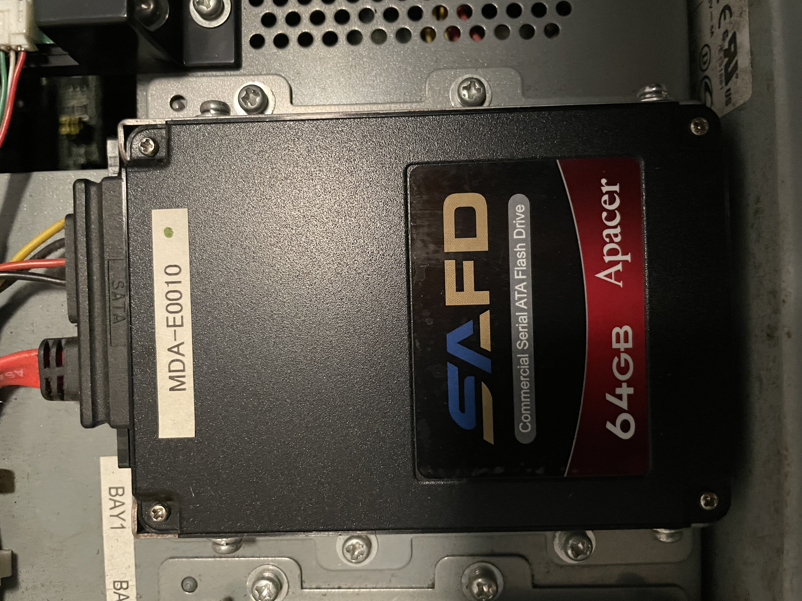
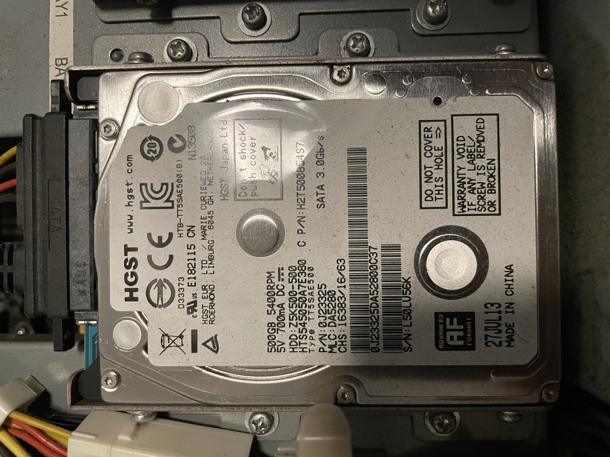

# Disk

The Sega Nu included 2 bays for mass storage. One is used for system OS and the other for game data.

## System Disk 64GB SSD


## Data Disk 500 GB HDD


The Sega Nu I have for PDAFT is encrypted with bitlocker. While I am still in the process to recover the FVEK (Full Volume Encryption Key). Here is a overview of the partition layout on the system disk.


## System Disk Paritions
```
Disk /dev/sdb: 59.63 GiB, 64023257088 bytes, 125045424 sectors
Disk model: A Flash Drive
Units: sectors of 1 * 512 = 512 bytes
Sector size (logical/physical): 512 bytes / 512 bytes
I/O size (minimum/optimal): 512 bytes / 33553920 bytes
Disklabel type: dos
Disk identifier: 0x46a06ba5

Device     Boot    Start       End  Sectors  Size Id Type
/dev/sdb1  *        2048    718847   716800  350M  7 HPFS/NTFS/exFAT
/dev/sdb2         718848  42661887 41943040   20G  7 HPFS/NTFS/exFAT
/dev/sdb3       42661888  99284991 56623104   27G  7 HPFS/NTFS/exFAT
/dev/sdb4       99284992 125042687 25757696 12.3G  f W95 Ext'd (LBA)
/dev/sdb5       99287040 125042687 25755648 12.3G  7 HPFS/NTFS/exFAT

```

## Data Disk Partitions
Partition 3 starting 537135104 is encrypted with bitlocker
```
Disk /dev/sdb: 465.76 GiB, 500107862016 bytes, 976773168 sectors
Disk model: 545050A7E380    
Units: sectors of 1 * 512 = 512 bytes
Sector size (logical/physical): 512 bytes / 4096 bytes
I/O size (minimum/optimal): 4096 bytes / 4096 bytes
Disklabel type: gpt
Disk identifier: 8AEAE091-CC08-4E7C-BB31-219EC20C1C7E

Device         Start       End   Sectors   Size Type
/dev/sdb1         34    262177    262144   128M Microsoft reserved
/dev/sdb2     264192 537135103 536870912   256G Microsoft basic data
/dev/sdb3  537135104 976773119 439638016 209.6G Microsoft basic data

Partition 1 does not start on physical sector boundary.


```