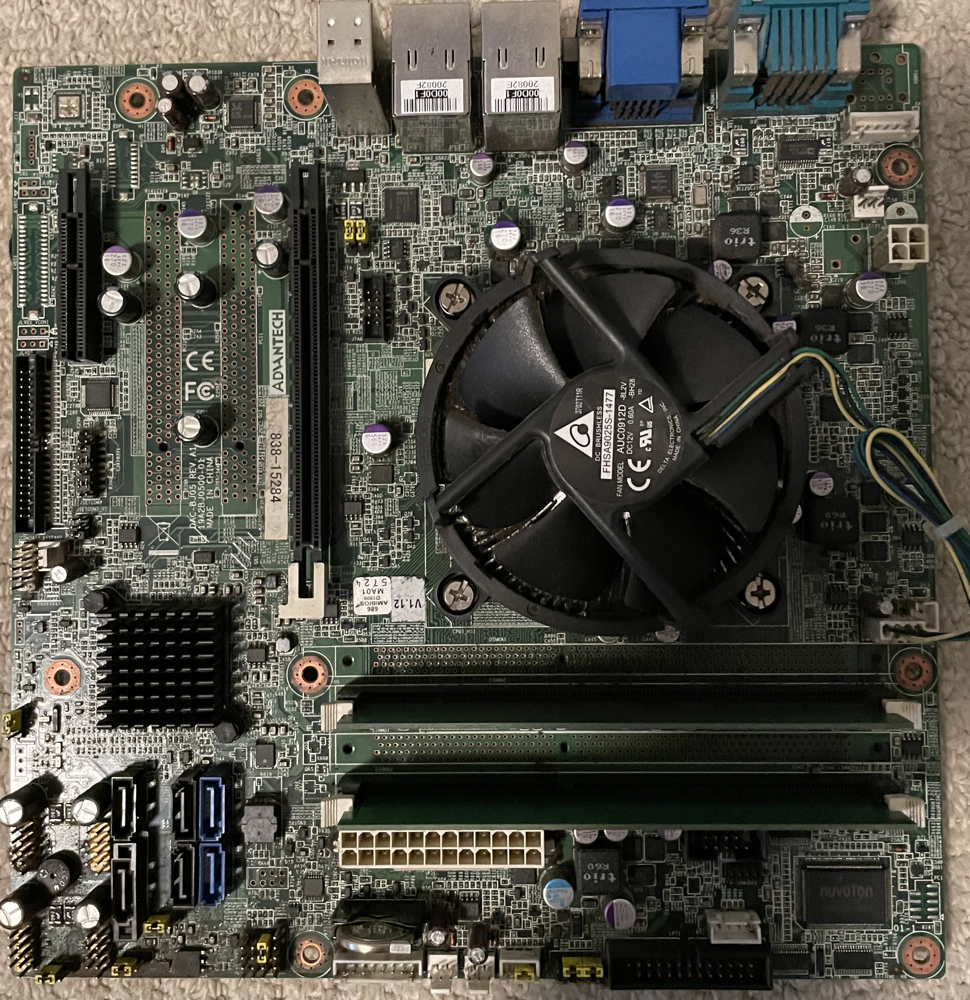
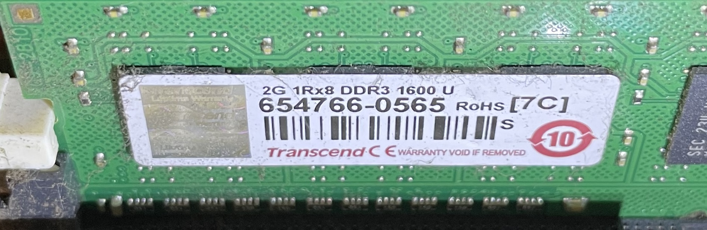
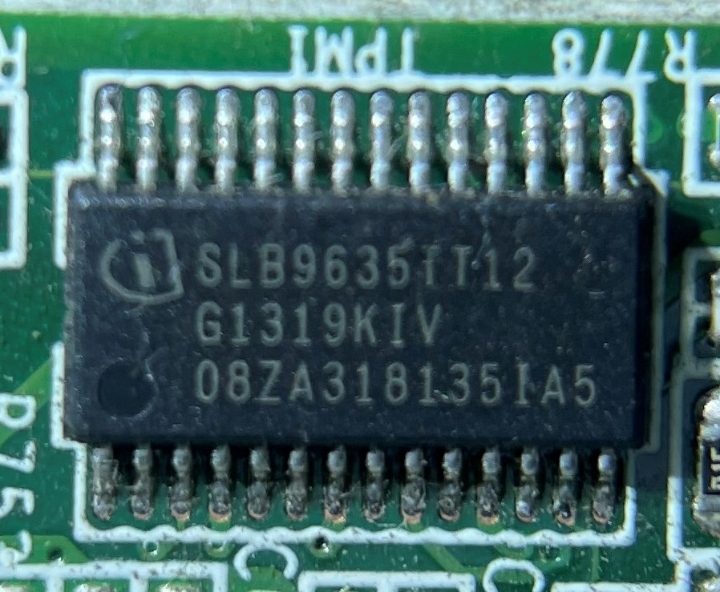
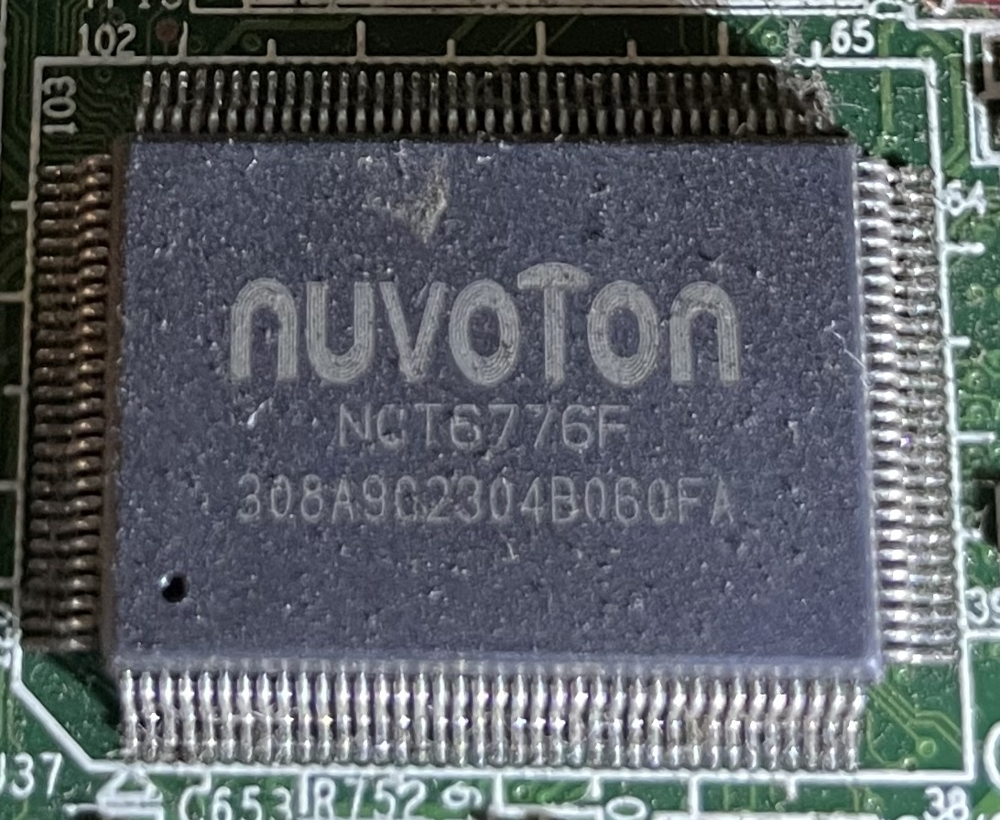
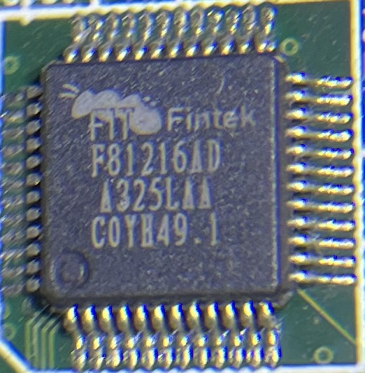
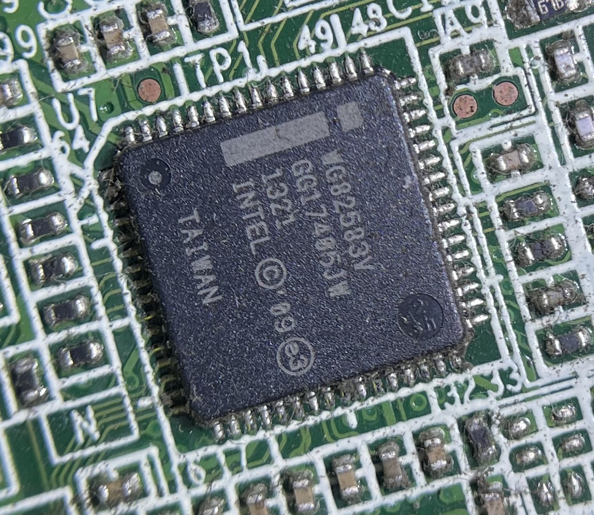

# Motherboard

The motherboard is a custom moderboard with unknown bios (haven't powered on to test it yet), it only has two Pcie slots and two DIMM slots.

## Memory
The motherboard has two 2GB DDR3 1600 from Transcend

## TPM
The motherboard include an TPM chip for disk encryption, 2 partitions on the System Drive is encrypted with bitlocker and 1 partition on the Data Drive is encrypted with bitlocker, it is believed they all use different FVEK for the encryption.

The TPM chip used is SLB96350 TPM 1.2 device. TPM LPC sniffing attack is possible to extract the FVEK keys. (Due to the complex solderng required, I might fail extracting the key, but it totally doable)

* [TPM key extraction](https://pulsesecurity.co.nz/articles/TPM-sniffing)

## IO
This motherboard uses an [Nuvoton NCT6776F](https://static6.arrow.com/aropdfconversion/b19813efc8e1635369c0c75d2e50037b046c2513/nct6776f_nct6776d_datasheet_v1_2.pdf) for LPC IO

It also got a [Fintek F81866A](https://www.fintek.com.tw/index.php/products/i-o-controller-and-i-f-management/item/59-f81866a) for parallel, uart, etc

## Ethernet
The enternet controller on this motherboard is Intel's [82583V](https://ark.intel.com/content/www/us/en/ark/products/41676/intel-82583v-gigabit-ethernet-controller.html) 

## Sound
The sound chip used is Realtek's [ALC886](https://www.realtek.cz/download-ALC886-sound-driver-for-Windows10-64bit.html)

