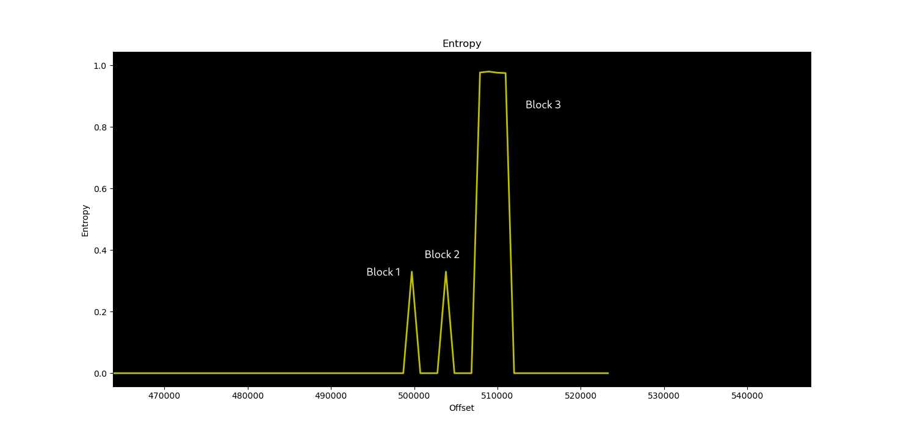

# Firmware

The PCB includes a Winbond flash 512KB, the assumption is the flash will include program data or bootrom.

## Flash Dump

After dumping the flash, it look like most part of the dump is either 00 or FF, only three blocks of data exist in the dump.

### Block #1

Offset: `7A000`

Size: `0x110`

SHA1: ccdf6b88a06ffbfab05dc3afc9262b448883a8af

### Block #2

Offset: `7B000`

Size: `0x110`

SHA1: ccdf6b88a06ffbfab05dc3afc9262b448883a8af

- Note: Block #1 and Block #2 are identical

### Block #3

Offset: `7C000`

Size: `0x1000`

SHA1: bb6f09d50076354cf1e013a767054150c6a6e550

## Findings

A simple binwalk produce no output, and the entropy graph indicates the Block #3 is likely encrypted, Block 1&2 is probably data.

