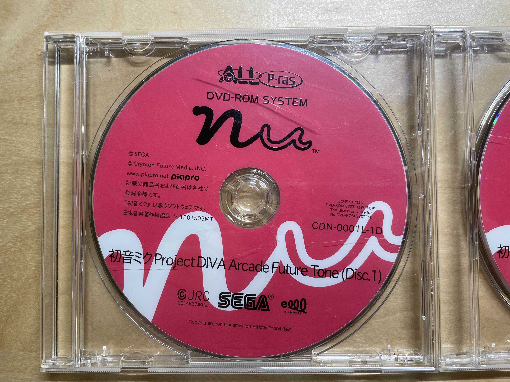

# Media

The game install media uses a traditional DVD-ROM disk (probably double layered). You are able to read the content of the disc if you have the disk media, but without keychip and main application, it is unknown if you can dump the contents.

## Picture

Hatsune Miku Project Diva Arcade Future Tone
